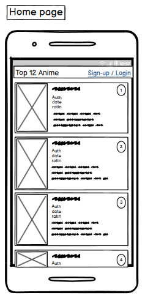

<h1 align="center">Top 12 Anime</h1>

[View the live project here](https://top-10-anime-f8c245cd60e9.herokuapp.com/)

The project contains an application called Top 12 Anime which is a website that gives details on the top 12 rated anime of all time.

The admin user of the site can manage comments to keep the website a respectable and harmfree place

## Index – Table of Contents
* [User Experience (UX)](#user-experience-ux) 
* [Features](#features)
* [Design](#design)
* [Planning](#planning)
* [Technologies Used](#technologies-used)
* [Testing](#testing)
* [Deployment](#deployment)
* [Credits](#credits)

## User Experience (UX)

### User stories :

* US01: View Top 10 Rated Anime
  - As a visitor, I want to view a list of the top 10 rated anime, with their ratings, genres, and images, so I can easily find out about the best anime
* US02: View Details page
  - As a visitor, I want to click on an anime title to view more detailed information such as the plot, characters, release date, and predefined ratings.
* US03: User sign-up
  -As a new user, I want to create an account with my email and password, so I can leave comments and like/dislike anime or comments.
* US04: User login
  - As a returning user, I want to log in to my account, so I can interact with the content (comment, like/dislike).
* US05: Admin panel
  - As an admin, I want to manage user accounts and interactions, so I can moderate content for the website.
* US06: Admin comment management
  - As an admin, I want to moderate user comments and delete inappropriate or harmful content, so I can ensure the site remains a positive space.
* US07: Add comments
  - As a logged-in user, I want to comment on my favorite anime from the list, so I can share my thoughts with other fans.
* US08: Like/Dislike Anime
  - As a logged-in user, I want to like or dislike an anime and other users' comments, so I can engage with the community.

## Features

### Existing Features

-   __F01 Navigation Bar__
    
    The navigation bar has a consistent look and placement each page supporting easy and intuitive navigation.  It includes a Logo, and a link to the Home page. If the user is not signed in then links are available to the Sign-up page.  If a user is signed in then the links available, in addition to the Home link, are for  and Sign out; and the active username and a user icon are also displayed.
    
    If the user signed in is the admin user then an additional link of Admin is also shown on the navigation bar.  This link takes the user to the Django Admin screens where data in the underlying database can be added, retrieved, modified and deleted.
    
    The navigation bar is responsive on multiple screen sizes - on smaller screens it coverts to a 'burger' menu style.  
    
    
    
    

-   __F02 Landing page image and text__
    
    At the top of the landing page (home page) there is an area that includes a photograph and a text overlay which together clearly identify the purpose of the site as a place to find and book guided hikes in Banff.  

    

    

    

    

    

-   __F10 User authentication__
    
    The application provides the following user authentication related functions :

    - User Registration
      - A user needs to be registered before they can sign in.  The option to Register appears on the navigation bar when no user is currently signed in.  To Register, the user needs to provide a) a username which has not already been registered, b) an optional email address (if this is provided then it needs to be an email address that is not already registered) and c) a password which they must enter twice.  Once registered a user can sign in.

        

    - User Sign in
      - Once registered a user can sign in and will have access to extra functionality, namely :
        - can comment on a anime
        - can like a anime

      - To sign in the user must provide a) a registered username and b) the password for the username
     
        
      
    - User Sign out
      - A signed in user can sign out by clicking on the Sign out link on the navigation bar.  The user simply needs to confirm the action by clicking on the Sign out button on the page.

        

### Features which could be implemented in the future

## Design

-   ### Wireframes

    The wireframe diagrams below describe the Home, Login, Logout and Sign-up pages.
    

    
Desktop Wireframes

    
    
    
    

    

    
Tablet Wireframes

    
    
    
    

    

    
Smartphone Wireframes

    
    
    
    

## Planning

A GitHub Project with linked Issues was used as the Agile tool for this project.  User Stories with acceptance criteria were defined using GitHub Issues and development of code for these stories was managed using a Kanban board.  All of the User Stories were linked to a 'parent' Epic issue to show how they all supported the over-arching goal of the project.  The acceptance criteria were tested as each story moved to 'Done' and were also included in the final pre-submission manual testing documented in the Testing section of this README.

The Epic, User Stories and Kanban board can be accessed here : [Project board](https://github.com/users/JackH1155/projects/2/views/1)

## Technologies Used

### Languages Used

-   [HTML5](https://en.wikipedia.org/wiki/HTML5)
-   [CSS3](https://en.wikipedia.org/wiki/Cascading_Style_Sheets)
-   [Python](https://www.python.org/)

### Frameworks, Libraries & Programs Used

## Testing

### Validator Testing 

- [HTML Validator](https://validator.w3.org/)

- results for index.html
      - 

        
Homepage

        
      

- results for post_details.html
      - 

        
Anime Details

        
      

- results for user_bio.html
      - 

        
User Profile

        
      

- results for edit_bio.html
      - 

        
Edit Profile

        
      

- results for signup.html
      - 

        
Signup

        
      

- results for login.html
      - 

        
Login

        
      

- results for signout.html
      - 

        
Logout

        
      

- [CSS Validator](https://jigsaw.w3.org/css-validator/)

 - 

      
style.css validation results

      
      

- [Python Validator]([http://pep8online.com/](https://pep8ci.herokuapp.com/))

  

    
Top 10 Anime urls.py validation results

    
  

    
Project settings.py validation results

  
  

    
Blog urls.py validation results

  
   

    
Blog admin.py validation results

  
   

    
Blog forms.py validation results

  
   

    
Blog models.py validation results

  
   

    
Blog views.py validation results

  
  

    
UserBio admin.py validation results

  
  

    
UserBio forms.py validation results

  
  

    
UserBio models.py validation results

  
  

    
UserBio views.py validation results

  
  

### Browser Compatibility

- Chrome DevTools was used to test the responsiveness of the application on different screen sizes.  In addition, testing has been carried out on the following browsers :
    - Google Chrome version
    - Opera
    - Microsoft Edge

    

### Known bugs

- Some images on homepage are to small.
- Profile default image doesn't load.

## Deployment

Detailed below are instructions on how to clone this project repository and the steps to configure and deploy the application.  Code Institute also provides a summary of similar process steps here : [CI Cheat Sheet](https://codeinstitute.s3.amazonaws.com/fst/Django%20Blog%20Cheat%20Sheet%20v1.pdf)

1. How to Clone the Repository
2. Create Application and Postgres DB on Heroku
3. Configure Cloudinary to host images used by the application
4. Connect the Heroku app to the GitHub repository
5. Executing automated tests
6. Final Deployment steps

### Create Application and Postgres DB on Heroku
- Log in to Heroku at https://heroku.com - create an account if needed.
- From the Heroku dashboard, click the Create new app button.  For a new account an icon will be visible on screen to allow you to Create an app, otherwise a link to this function is located under the New dropdown menu at the top right of the screen.
- On the Create New App page, enter a unique name for the application and select region.  Then click Create app.
- On the Application Configuration page for the new app, click on the Resources tab.
- In the Add-ons search bar enter "Postgres" and select "Heroku Postgres" from the list - click the "Submit Order Form" button on the pop-up dialog.
- Next, click on Settings on the Application Configuration page and click on the "Reveal Config Vars" button - check the DATABASE_URL has been automatically set up. 
- Add a new Config Var called DISABLE_COLLECTSTATIC and assign it a value of 1.
- Add a new Config Var called SECRET_KEY and assign it a value - any random string of letters, digits and symbols.
- The settings.py file should be updated to use the DATABASE_URL and SECRET_KEY environment variable values as follows :

  - DATABASES = {'default': dj_database_url.parse(os.environ.get('DATABASE_URL'))}

  - SECRET_KEY = os.environ.get('SECRET_KEY')

- In Gitpod, in the project terminal window, to initialize the data model in the postgres database, run the command : python3 manage.py migrate 
- Make sure the project requirements.txt file is up to date with all necessary supporting files by entering the command : pip3 freeze --local > requirements.txt
- Commit and push any local changes to GitHub.
- In order to be able to run the application on localhost, add SECRECT_KEY and DATABASE_URL and their values to env.py

### Connect the Heroku app to the GitHub repository
- Go to the Application Configuration page for the application on Heroku and click on the Deploy tab.
- Select GitHub as the Deployment Method and if prompted, confirm that you want to connect to GitHub. Enter the name of the github repository (the one used for this project is () and click on Connect to link up the Heroku app to the GitHub repository code.
- Scroll down the page and choose to either Automatically Deploy each time changes are pushed to GitHub, or Manually deploy - for this project Manual Deploy was selected.
- The application can be run from the Application Configuration page by clicking on the Open App button.
- The live link for this project is ()

### Final Deployment steps

#### The live link to the application can be found here - [) 

## Credits 
Used this README https://github.com/elainebroche-dev/pf4-wayfarers-guided-hikes/blob/main/README.md as a base skeleton for my README.

Got images and details from https://www.imdb.com/search/title/?keywords=anime&sort=user_rating,desc

### Code 

Some of the code is from the CodeStar blog walkthrough. I changed it a little to fit into my project.

I have used ChatGPT to help with some issues and some code stucture.

### Content 

Imformation on the top 12 rated Anime.

### Media 

  
  
### Acknowledgments

